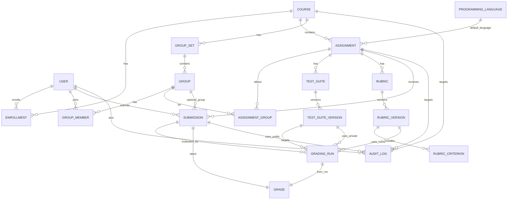

```mermaid
erDiagram
  %% ========= Core =========
  USER   ||--o{ ENROLLMENT : enrolls
  COURSE ||--o{ ENROLLMENT : has

  COURSE               ||--o{ ASSIGNMENT : contains
  PROGRAMMING_LANGUAGE ||--o{ ASSIGNMENT : default_language

  %% ========= Groups =========
  COURSE    ||--o{ GROUP_SET : has
  GROUP_SET ||--o{ GROUP     : contains
  GROUP     ||--o{ GROUP_MEMBER : has
  USER      ||--o{ GROUP_MEMBER : joins

  ASSIGNMENT ||--o{ ASSIGNMENT_GROUP : allows
  GROUP      ||--o{ ASSIGNMENT_GROUP : for

  %% ========= Tests & Rubrics =========
  ASSIGNMENT ||--o{ TEST_SUITE : has
  TEST_SUITE ||--o{ TEST_SUITE_VERSION : versions

  ASSIGNMENT     ||--o{ RUBRIC : has
  RUBRIC         ||--o{ RUBRIC_VERSION : versions
  RUBRIC_VERSION ||--o{ RUBRIC_CRITERION : includes

  %% ========= Submissions & Grading =========
  ASSIGNMENT ||--o{ SUBMISSION : receives
  USER       ||--o{ SUBMISSION : submits
  GROUP      ||--o{ SUBMISSION : optional_group

  SUBMISSION         ||--o{ GRADING_RUN : evaluated_by
  TEST_SUITE_VERSION ||--o{ GRADING_RUN : uses_public
  TEST_SUITE_VERSION ||--o{ GRADING_RUN : uses_private
  RUBRIC_VERSION     ||--o{ GRADING_RUN : uses_rubric

  SUBMISSION  ||--|| GRADE : latest
  GRADING_RUN ||--|| GRADE : from_run

  %% ========= Audit =========
  USER       ||--o{ AUDIT_LOG : acts
  COURSE     ||--o{ AUDIT_LOG : targets
  ASSIGNMENT ||--o{ AUDIT_LOG : targets
  SUBMISSION ||--o{ AUDIT_LOG : targets

```